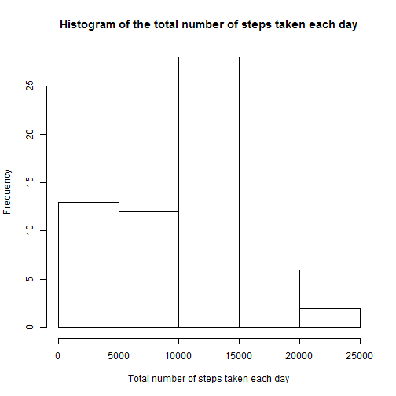
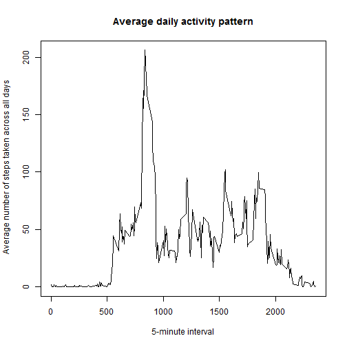
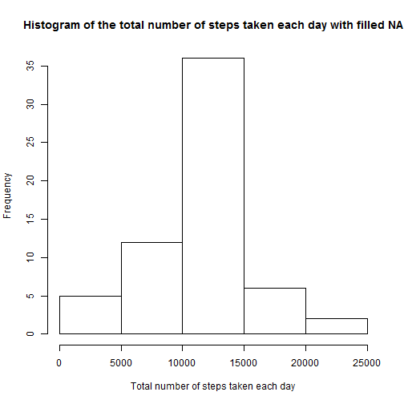

Project1
========================================================
Read table into R and change into data table

```r
activity <- read.csv("C:/Users/David/Dropbox/Coursea/Reproducible Research/repdata-data-activity/activity.csv", 
    na.strings = "NA")
library("data.table")
actDT = as.data.table(activity)
```


Get a summary and structure of the dataset

```r
summary(actDT)
```

```
##      steps               date          interval   
##  Min.   :  0.0   2012-10-01:  288   Min.   :   0  
##  1st Qu.:  0.0   2012-10-02:  288   1st Qu.: 589  
##  Median :  0.0   2012-10-03:  288   Median :1178  
##  Mean   : 37.4   2012-10-04:  288   Mean   :1178  
##  3rd Qu.: 12.0   2012-10-05:  288   3rd Qu.:1766  
##  Max.   :806.0   2012-10-06:  288   Max.   :2355  
##  NA's   :2304    (Other)   :15840
```

```r
str(actDT)
```

```
## Classes 'data.table' and 'data.frame':	17568 obs. of  3 variables:
##  $ steps   : int  NA NA NA NA NA NA NA NA NA NA ...
##  $ date    : Factor w/ 61 levels "2012-10-01","2012-10-02",..: 1 1 1 1 1 1 1 1 1 1 ...
##  $ interval: int  0 5 10 15 20 25 30 35 40 45 ...
##  - attr(*, ".internal.selfref")=<externalptr>
```

                 
Change date to Date field

```r
actDT[, `:=`(date, as.Date(date, "%Y-%m-%d"))]
```

```
##        steps       date interval
##     1:    NA 2012-10-01        0
##     2:    NA 2012-10-01        5
##     3:    NA 2012-10-01       10
##     4:    NA 2012-10-01       15
##     5:    NA 2012-10-01       20
##    ---                          
## 17564:    NA 2012-11-30     2335
## 17565:    NA 2012-11-30     2340
## 17566:    NA 2012-11-30     2345
## 17567:    NA 2012-11-30     2350
## 17568:    NA 2012-11-30     2355
```


##What is the mean total number of steps taken per day?

Calculate the total number of steps take each day

```r
total.steps.by.date = actDT[, sum(steps, na.rm = T), by = date]
```


Change column names to dates and total.steps

```r
setnames(total.steps.by.date, 1:2, c("dates", "total.steps"))
```


Make a histogram of the total number of steps taken each day

```r
hist(total.steps.by.date[, total.steps], main = "Histogram of the total number of steps taken each day", 
    xlab = "Total number of steps taken each day")
```

 


Calculate the mean and median total number of steps taken per day

```r
total.steps.by.date[, c(mean = mean(total.steps, na.rm = T), median = median(total.steps, 
    na.rm = T))]
```

```
##   mean median 
##   9354  10395
```


##What is the average daily activity pattern?

Calculate the the average number of steps taken all days by time interval

```r
avg.steps.by.interval = actDT[, mean(steps, na.rm = T), by = interval]
setnames(avg.steps.by.interval, 1:2, c("interval", "avg.steps"))
```


Make the time series plot 

```r
plot(avg.steps.by.interval$interval, avg.steps.by.interval$avg.steps, type = "l", 
    xlab = "5-minute interval", ylab = " Average number of steps taken across all days", 
    main = "Average daily activity pattern")
```

 


calculate Which 5-minute interval, on average across all the days in the dataset,contains the maximum number of steps

```r
avg.steps.by.interval[avg.steps == max(avg.steps, na.rm = T), ]
```

```
##    interval avg.steps
## 1:      835     206.2
```


##Imputing missing values

Calculate and report the total number of missing values in the dataset 

```r
sum(!complete.cases(actDT))
```

```
## [1] 2304
```


fill in all missing values by the mean for that 5-minute interval
set interval as key column and merge actDT with avg.steps.by.interval

```r
setkey(actDT, interval)
setkey(avg.steps.by.interval, interval)
actDT = actDT[avg.steps.by.interval]
```


change steps from int to double before filling the NA with avg.steps

```r
actDT[, `:=`(steps, as.numeric(steps))]
```

```
##        interval steps       date avg.steps
##     1:        0    NA 2012-10-01     1.717
##     2:        0     0 2012-10-02     1.717
##     3:        0     0 2012-10-03     1.717
##     4:        0    47 2012-10-04     1.717
##     5:        0     0 2012-10-05     1.717
##    ---                                    
## 17564:     2355     0 2012-11-26     1.075
## 17565:     2355     0 2012-11-27     1.075
## 17566:     2355     0 2012-11-28     1.075
## 17567:     2355     0 2012-11-29     1.075
## 17568:     2355    NA 2012-11-30     1.075
```

```r
actDT[is.na(steps), `:=`(steps, avg.steps)]
```

```
##        interval  steps       date avg.steps
##     1:        0  1.717 2012-10-01     1.717
##     2:        0  0.000 2012-10-02     1.717
##     3:        0  0.000 2012-10-03     1.717
##     4:        0 47.000 2012-10-04     1.717
##     5:        0  0.000 2012-10-05     1.717
##    ---                                     
## 17564:     2355  0.000 2012-11-26     1.075
## 17565:     2355  0.000 2012-11-27     1.075
## 17566:     2355  0.000 2012-11-28     1.075
## 17567:     2355  0.000 2012-11-29     1.075
## 17568:     2355  1.075 2012-11-30     1.075
```


number of missing steps

```r
actDT[, sum(is.na(steps))]
```

```
## [1] 0
```


Create a new dataset that is equal to the original dataset but with the missing data filled in.

```r
actDT.filled = actDT[, 1:3, with = F]
```


Calculate the total number of steps take each day for actDT.filled

```r
total.steps.by.date = actDT.filled[, sum(steps, na.rm = T), by = date]
```


change column names to dates and total.steps

```r
setnames(total.steps.by.date, 1:2, c("dates", "total.steps"))
```


Make a histogram of the total number of steps taken each day

```r
hist(total.steps.by.date[, total.steps], main = "Histogram of the total number of steps taken each day with filled NA", 
    xlab = "Total number of steps taken each day")
```

 


Calculate the mean and median total number of steps taken per day

```r
total.steps.by.date[, c(mean = mean(total.steps, na.rm = T), median = median(total.steps, 
    na.rm = T))]
```

```
##   mean median 
##  10766  10766
```


**Do these values differ from the estimates from the first part of the assignment?** 
Yes

**What is the impact of imputing missing data on the estimates of the total daily number of steps?**
The mean and the median is now the same.

##Are there differences in activity patterns between weekdays and weekends?

```r
actDT.filled = actDT.filled[(weekdays(date) == "Saturday" | weekdays(date) == 
    "Sunday"), `:=`(weekday, "weekend")]
actDT.filled = actDT.filled[!(weekdays(date) == "Saturday" | weekdays(date) == 
    "Sunday"), `:=`(weekday, "weekday")]
actDT.filled = actDT.filled[, `:=`(weekday, factor(weekday))]
```


calculate the the average number of steps taken all days by time interval

```r
avg.steps.by.weekday = actDT.filled[, mean(steps), by = list(weekday, interval)]
setnames(avg.steps.by.weekday, 1:3, c("weekday", "interval", "avg.steps"))
```


Make the time series plot 

```r
library("ggplot2")
qplot(interval, avg.steps, data = avg.steps.by.weekday, facets = weekday ~ ., 
    geom = "line") + labs(y = "Number of steps")
```

 

